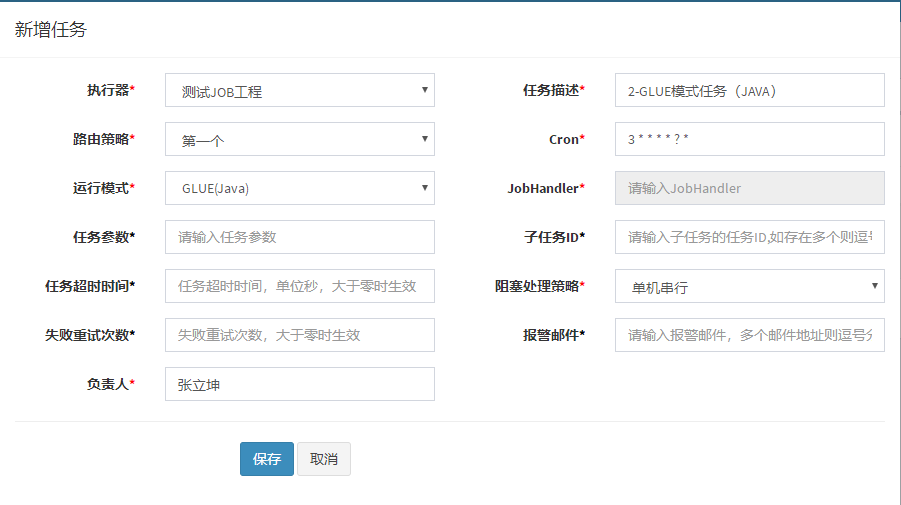

# [XXL-JOB](https://github.com/xuxueli/xxl-job/)

#### [官方文档]()http://www.xuxueli.com/xxl-job/#/)
- [部署项目](http://www.xuxueli.com/xxl-job/#/?id=%e6%ad%a5%e9%aa%a4%e4%ba%8c%ef%bc%9a%e9%83%a8%e7%bd%b2%e9%a1%b9%e7%9b%ae%ef%bc%9a)
- [任务详解](http://www.xuxueli.com/xxl-job/#/?id=%e4%b8%89%e3%80%81%e4%bb%bb%e5%8a%a1%e8%af%a6%e8%a7%a3)

#### 配置执行器及任务
新增执行器  

新增一个任务  

新增一个GLUE任务  

GLUE任务支持多种语言（脚本），创建任务后，在任务列表中有GLUE按钮，可以进入编辑页，可以自行编写脚本任务。

但GLUE类的任务，实际并非由xxl-job的管理端执行，而是由注册的客户端执行，所以在测试时Python、Shell等语言可能会失败（是由于客户端没有安装相应的语言环境或解释器导致）。

实际应用中，BEAN模式才是主流。